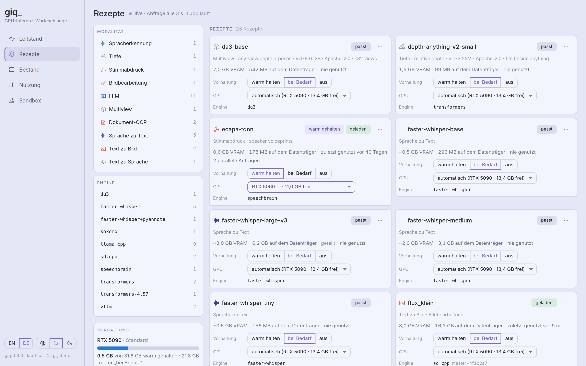

<!--
SPDX-FileCopyrightText: 2026 vikworks UG (haftungsbeschränkt)

SPDX-License-Identifier: Apache-2.0
-->

# Development

```bash
# Run tests
make test

# Format code
make fmt

# Type check
make check
```

On a machine where `nvidia-smi` works, `make test` also runs the GPU
integration tests, which load real models; on a machine that is serving, run
the CPU suite instead:
`uv run pytest --ignore=tests/test_dirty_workers_integration.py`. Agent and
contributor rules (no hardcoded machine paths, REUSE headers, comment style)
are in [AGENTS.md](../AGENTS.md).

## Dashboard

The dashboard at `/dash` is a React + TypeScript app in `frontend/` (Vite,
no CSS framework, hand-drawn SVG charts), styled with the Nocturne design
system's tokens. It builds into `src/giq/static/ui/`, which is gitignored but
included in the wheel; without a build, `/dash` says how to make one.

```bash
make ui          # npm ci + production build into src/giq/static/ui/
make ui-dev      # Vite dev server on http://localhost:5173/dash/ with hot reload
cd frontend && npm test && npx tsc --noEmit
```

`make ui-dist` builds and packs it as `dist/giq-ui-<version>.tar.gz` (plus a
`.sha256`) for a server that cannot build it (`make ui-pack` packs an existing
build); the archive is reproducible, so one commit gives one checksum. See
[deployment.md](deployment.md#dashboard-on-the-server).

`make ui-dev` proxies every API path (`/status`, `/gpus`, `/stats`, `/storage`,
`/control`, `/engines`, `/run`, `/jobs`, `/v1`, `/capabilities`) to the giq on
`127.0.0.1:8084` (`make ui-dev PORT=…` or `GIQ_URL` to change it). The proxy drops the browser's `Origin`
header, since giq refuses requests from foreign origins and the dev server is
one. Everything the page needs is bundled (the Inter font, Phosphor icons), so
it works on a rig with no internet.

### Third-party licences

The build writes `THIRD_PARTY_LICENSES.txt` next to the dashboard (it ships in
the wheel as `giq/static/ui/THIRD_PARTY_LICENSES.txt`): every npm package whose
code or assets end up in the bundle, with its version, licence and full licence
text. [`rollup-plugin-license`](https://github.com/mjeanroy/rollup-plugin-license)
finds the JavaScript packages, and `frontend/scripts/third-party-licenses.ts`
adds packages pulled in through CSS (the Inter font, OFL-1.1). The build fails
when a bundled package declares no licence, ships no licence file, or uses one
outside the allowlist: MIT, ISC, BSD-2-Clause, BSD-3-Clause, Apache-2.0,
OFL-1.1, 0BSD. When a new dependency trips it, check that its licence is
compatible with shipping inside an Apache-2.0 wheel before adding the
identifier to `ALLOWED` in that file; otherwise pick another package.
Development dependencies are never bundled and are not listed, and the Python
dependencies are installed by the user rather than shipped, so they are out of
scope.

## Languages

The UI is in English and German.



Strings live in
`frontend/src/locales/<lang>/<namespace>.json` (namespaces `common`,
`overview`, `recipes`, `inventory`, `usage`, `sandbox`), and German terminology follows
`frontend/src/locales/GLOSSARY.md`. To add a language, copy `en/` to
`<code>/`, translate it, and add `{ code, label }` to `LANGUAGES` in
`frontend/src/i18n/index.ts`; `npm test` checks that every language has
exactly English's keys, with no blanks and the same placeholders.

## Releases

CI (`.github/workflows/ci.yml`) builds and tests every push and pull request,
then uploads two workflow artifacts: `giq-<version>-python` (wheel and sdist;
the wheel carries the dashboard and its `THIRD_PARTY_LICENSES.txt`) and
`giq-ui-<version>` (the dashboard tarball, as `make ui-pack` makes it).

To release, set `version` in `pyproject.toml`, commit, then tag and push:

```bash
git tag -a v0.3.1 -m "giq 0.3.1"
git push origin main v0.3.1
```

The tag's run fails unless the tag is `v` plus the `pyproject.toml` version.
Its `release` job then creates the GitHub Release for the tag (or adds to one
that exists, replacing files of the same name) and attaches
`giq-<version>-py3-none-any.whl`, `giq-<version>.tar.gz`,
`giq-ui-<version>.tar.gz` and a `SHA256SUMS` over all three. A server
installs that dashboard with `install-debian.sh --ui-release v<version>`,
which checks it against `SHA256SUMS`. To redo a release, fix the cause and
re-run the tag's workflow; moving a tag means deleting and re-pushing it.

`tests/deploy/test-ui-install.sh [tarball]` tests the installer's dashboard
step without root (tarball checks, the swap, and `--ui-release` against a
local stand-in for the GitHub API); CI runs it on the tarball it built.

## Architecture

See [ADR-001-ontology.md](ADR-001-ontology.md) for design decisions,
[ADR-002-model-instances.md](ADR-002-model-instances.md) for recipe files
(weights, engine, parameters) and [ADR-003-domain.md](ADR-003-domain.md) for
the terms the code and the API use: engine, weights, recipe, instance,
residency, modality.
